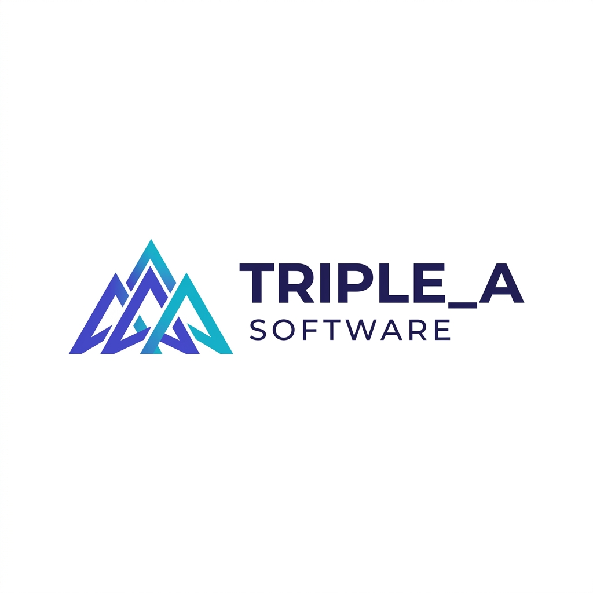

<div align="center">

  

  # 🚀 Triple Software
  ### *Transformando ideas en soluciones digitales de alto impacto*

  [](https://nextjs.org/)
  [](https://www.typescriptlang.org/)
  [](https://tailwindcss.com/)
  [](https://supabase.com/)
  [](https://x.ai/)

  [Explorar Demo](https://triplesoftware.com) · [Reportar Bug](https://github.com/IngMarlonPerez/tripleA_software/issues) · [Solicitar Funcionalidad](https://github.com/IngMarlonPerez/tripleA_software/issues)

</div>

---

## 📖 Sobre el Proyecto

**Triple Software** es una plataforma corporativa de vanguardia diseñada para ofrecer una experiencia digital excepcional. Construida con el stack más moderno de la industria, la plataforma integra inteligencia artificial avanzada (Grok-3) y una arquitectura escalable para gestionar leads, proyectos y comunicación empresarial de manera eficiente.

### 🌟 Características Principales

- **🤖 Chatbot Inteligente:** Integración directa con Grok API para atención al cliente 24/7.
- **💼 Portafolio Dinámico:** Gestión de proyectos con filtrado avanzado y detalles optimizados.
- **🔐 Seguridad Enterprise:** Autenticación robusta con Supabase Auth y políticas RLS.
- **📈 Captación de Leads:** Formularios inteligentes con validación Zod y notificaciones en tiempo real.
- **⚡ Rendimiento Extremo:** Optimización de Core Web Vitals para una carga instantánea.

---

## 🛠️ Stack Tecnológico

| Herramienta | Propósito |
| :--- | :--- |
| **Next.js 15** | Framework React con App Router y Server Components. |
| **Tailwind CSS** | Estilizado moderno, responsivo y de alto rendimiento. |
| **TypeScript** | Tipado estático para un desarrollo robusto y mantenible. |
| **Supabase** | Base de Datos PostgreSQL, Autenticación y Almacenamiento. |
| **Framer Motion** | Animaciones fluidas y experiencias interactivas. |
| **Grok API** | Cerebro de IA para interacción inteligente. |

---

## 🏗️ Estructura del Proyecto

```bash
triplesoftware/
├── app/             # Rutas y lógica de servidor (Next.js App Router)
├── components/      # Componentes de UI y Secciones reutilizables
├── config/          # Configuraciones globales (colores, sitio, servicios)
├── lib/             # Utilidades, clientes de API y validaciones
├── public/          # Recursos estáticos (imágenes, logos)
├── types/           # Definiciones de tipos TypeScript
└── README.md        # Documentación principal
```

---

## 🚀 Instalación y Desarrollo

Sigue estos pasos para levantar el proyecto en tu entorno local:

1. **Clonar el repositorio:**
   ```bash
   git clone https://github.com/IngMarlonPerez/tripleA_software.git
   cd tripleA_software/triplesoftware
   ```

2. **Instalar dependencias:**
   ```bash
   npm install
   ```

3. **Configurar variables de entorno:**
   Crea un archivo `.env.local` basado en los requerimientos del sistema:
   ```env
   NEXT_PUBLIC_SUPABASE_URL=tu_url
   NEXT_PUBLIC_SUPABASE_ANON_KEY=tu_key
   GROK_API_KEY=tu_grok_key
   ```

4. **Iniciar servidor de desarrollo:**
   ```bash
   npm run dev
   ```

---

## 📄 Licencia

Este proyecto está bajo la Licencia de Triple Software. Consulta el archivo `LICENSE` para más detalles.

---

<div align="center">
  Hecho con ❤️ por <b>Triple Software Team</b>
</div>
